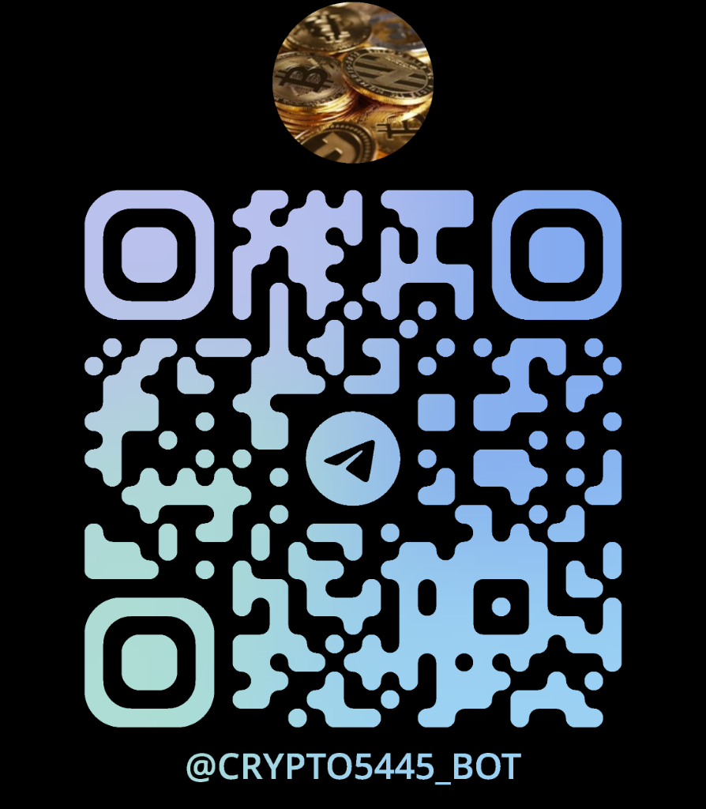

<div align="center">

# 📈 Crypto & Stock Tracker Telegram Bot

An advanced, AI-powered financial assistant bringing Wall Street and the Blockchain directly into your Telegram chat. 

[](https://www.python.org/)
[](https://flask.palletsprojects.com/)
[](https://core.telegram.org/bots)
[](https://opensource.org/licenses/MIT)

---

### 📸 Scan to Start Chatting



**Or click here to start chatting:** [@crypto5445_bot](https://t.me/crypto5445_bot)

</div>

---

## 📑 Table of Contents
- [Overview](#-overview)
- [Key Features](#-key-features)
- [System Architecture](#-system-architecture)
- [Prerequisites](#-prerequisites)
- [Installation & Setup](#-installation--setup)
- [Available Commands](#-available-commands)
- [Author](#-author)

---

## 🌟 Overview

The **Crypto & Stock Tracker Telegram Bot** is a high-performance microservice application designed to fetch real-time financial market data, generate interactive dark-themed charts, and provide live news headlines. Powered by a custom NLP conversational engine, it allows users to interact with financial data through natural human language.

---

## ✨ Key Features

* 🪙 **Deep Crypto Analytics:** Leverages the CoinGecko API to fetch rich data including Live Price, 24h Change, Market Cap, Volume, Circulating Supply, and All-Time Highs.
* 🏢 **Global Equities Tracking:** Integrated with Yahoo Finance to pull live market data for thousands of global publicly traded companies.
* 📉 **Interactive Visualizations:** Dynamically generates beautiful, dark-themed 7-Day and 30-Day graphical charts for market trends.
* 📰 **Real-Time Market News:** Aggregates top financial headlines and breaking news for specific assets.
* 🧠 **Conversational AI Engine:** Talk naturally! The built-in NLP engine strips out stop words and understands phrases like *"What is the price of Bitcoin?"* or *"Show me a chart for Tesla"*.
* 🧭 **Market Sentiment Tracking:** Monitors the global Fear & Greed index in real-time.

---

## 🛠️ System Architecture

This application utilizes a decoupled, asynchronous microservices architecture:

1. **`api_server.py` (Backend Gateway):** A lightweight Flask REST API that acts as a proxy/caching layer. It handles external requests to CoinGecko, Yahoo Finance, and Alternative.me, and generates `matplotlib` chart assets.
2. **`telegram_bot.py` (Client Interface):** Built with `PyTelegramBotAPI`. Handles user session context, natural language processing, Telegram callback queries, and inline keyboard UI rendering.

---

## ⚙️ Prerequisites

Before you begin, ensure you have the following installed:
* Python 3.8 or higher
* Git
* A Telegram Bot Token from [@BotFather](https://t.me/BotFather)

---

## 🚀 Installation & Setup

**1. Clone the repository**
```bash
git clone https://github.com/coderaarav12/Crypto_Tracker_Telegram_Bot.git
cd Crypto_Tracker_Telegram_Bot
```

**2. Install dependencies**
It is recommended to use a virtual environment.
```bash
pip install -r requirements.txt
```

**3. Configure Environment Variables**
Rename the `.env.example` file to `.env` and insert your secure Telegram token:
```env
TELEGRAM_BOT_TOKEN="YOUR_TELEGRAM_TOKEN_HERE"
```

**4. Start the Application**
Because of the microservice architecture, both processes must be running.

*Start the Backend API Server:*
```bash
python api_server.py
```

*Open a new terminal window and start the Telegram Bot:*
```bash
python telegram_bot.py
```

---

## ⌨️ Available Commands

| Command | Description |
| :--- | :--- |
| `/start` | Initializes the bot and loads the persistent keyboard menu |
| `/help` | Displays the interactive help module and quick-start guide |
| `/crypto` | Fetches a leaderboard of the Top 10 cryptocurrencies by Market Cap |
| `/trending` | Displays the top 7 trending coins today with quick-action buttons |
| `/news` | Fetches the top 5 general global market headlines |
| `/feargreed` | Returns the current global Fear & Greed sentiment index |
| `/about` | Displays developer and architectural information |

---

## 👨‍💻 Author

Proudly built and engineered by **Aarav Goel**, a 2nd-year student at SRM Institute of Science and Technology (SRMIST). 

*Dedicated to bridging the gap between Wall Street and the Blockchain.*
